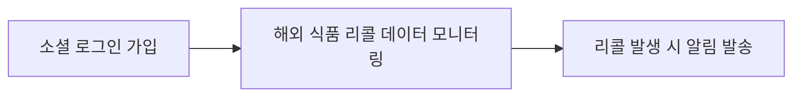
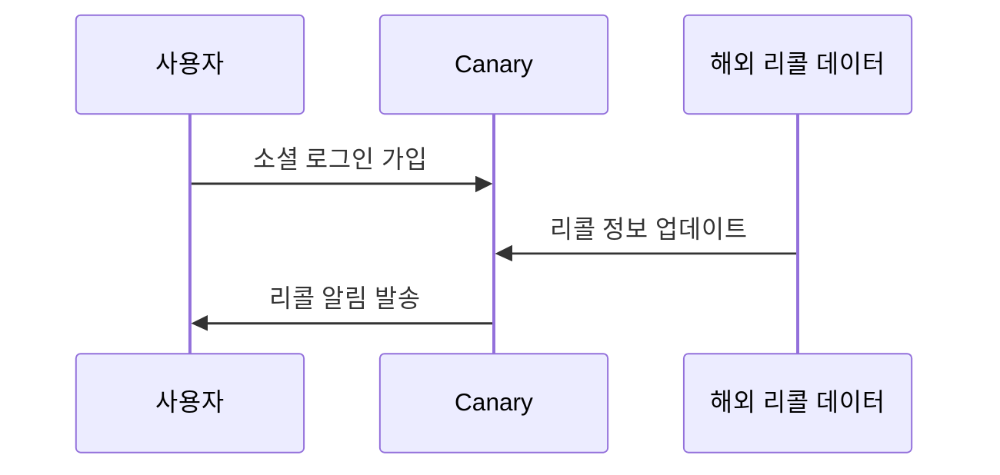

# Canary — 해외 식품 리콜 경보

- App Store: [apps.apple.com](https://apps.apple.com/kr/app/canary/id6772171185)
- Google Play: [play.google.com](https://play.google.com/store/apps/details?id=com.canaryapp.android&hl=ko)
- 개인정보처리방침: [sanglimsoft.com/privacy/canary](https://sanglimsoft.com/privacy/canary/)
- 고객지원: [sanglimsoft.com/support](https://sanglimsoft.com/support/)

**Canary**는 해외에서 발생한 식품 리콜 정보를 알림으로 받아볼 수 있는 서비스입니다. 소셜 로그인으로 가입해 관련 경보를 받습니다.

## 어떻게 동작하나요

### 이용 흐름

## 이런 분께 추천합니다

- 해외 직구 식품을 자주 구매하는 분
- 식품 안전 이슈를 빠르게 챙기고 싶은 분

## 주요 기능

- 해외 식품 리콜 경보 알림
- 소셜 로그인 가입
